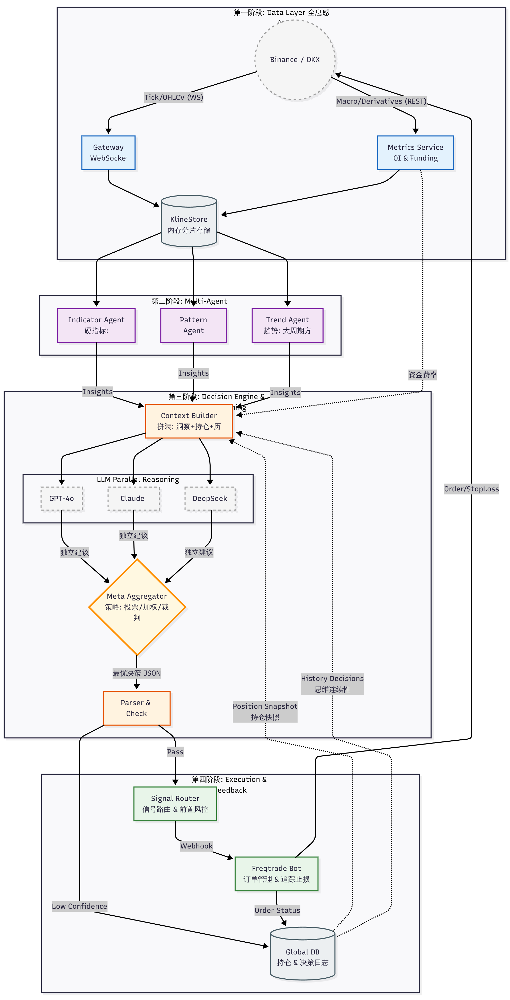

# Brale (Break a leg) 🎭

> **AI-Driven Multi-Agent Quantitative Strategy Engine**
> 
> *"Break a leg" in your trading journey!*

[](doc/README_CN.md)
[](go.mod)
[](LICENSE)

**Brale** is a quantitative strategy generator with AI decision-making at its core. Instead of holding funds directly, it acts as a "Super Brain," utilizing multiple agents (Technical Indicators, Pattern Recognition, Trend Analysis) to collaboratively analyze the market. It ultimately generates decision signals via an LLM (Large Language Model) provider and executes trades securely through the powerful [Freqtrade](https://github.com/freqtrade/freqtrade) engine.

## ✨ Key Features

- 🧠 **AI-Driven Decision Making**: Abandons traditional hard-coded logic in favor of LLM-based comprehensive analysis of multi-dimensional data, thinking like a human trader.
- 🤖 **Multi-Agent Collaboration**:
  - **Technical Agent**: Calculates hard indicators like EMA, RSI, MACD, ATR.
  - **Pattern Agent**: Identifies candlestick patterns (e.g., Head and Shoulders, Engulfing).
  - **Trend Agent**: Combines Multi-timeframe analysis to determine the broader trend.
- 🛡️ **Standing on the Shoulders of Giants**: Seamless integration with **Freqtrade**. You focus on strategy signals, while Freqtrade handles position management, stop-loss/take-profit, and exchange connectivity.
- ⚡ **High Performance**: Core logic written in Go, handling concurrent data fetching and indicator calculation for multiple coins.
- 📊 **Visualization & Explainability**: Generates charts and natural language analysis reports, letting you understand *why* the AI decided to open a trade.

## 🏗️ Architecture



1.  **Data Acquisition**: Fetches K-line data from exchanges like Binance.
2.  **Analysis**: Splits data into multiple timeframes and delegates it to Technical, Pattern, and Trend Agents for collaborative analysis.
3.  **Decision**: Aggregates Agent conclusions and generates a final decision via a Provider (e.g., LLM).
4.  **Execution**: Strategy signals are aggregated by weight and sent to Freqtrade for execution.

## 🚀 Quick Start (Docker)

### 1. Configuration

```bash
# Copy configuration templates
cp configs/config.example.toml configs/config.toml
cp configs/user_data/freqtrade-config.example.json configs/user_data/freqtrade-config.json

# Notes:
# 1. Fill in your LLM API Key in configs/config.toml
# 2. Configure Exchange API in configs/user_data/freqtrade-config.json (or use dry-run mode)
# 3. Update [ai.multi_agent], [ai.provider_preference], and K-line horizons in config.toml as needed, or use defaults.
# 4. Ensure [freqtrade.username] and [freqtrade.password] in config.toml match [api_server.username] and [api_server.password] in freqtrade-config.json.
# 5. To enable Telegram notifications: Set [telegram.enabled] in freqtrade-config.json AND [notify.telegram.enabled] in config.toml to true, then fill in the token and chat_id.
```

#### 1.1 Proxy Access
```bash
# 1. If using a proxy, enable [market.sources.proxy.enabled] in config.toml and fill in your HTTP/SOCKS5 links.
# 2. Uncomment the proxy environment variables in docker-compose.yml (for both freqtrade and brale services) and set HTTP_PROXY / HTTPS_PROXY to your local port.
# 3. Update [exchange.ccxt_config.proxies] and [exchange.ccxt_async_config.aiohttp_proxy] in config-proxy.json with your local port (copy these fields to your active config if needed).
```

### 2. Start Services

Recommended: Use the Make command for a one-click start (cleans environment, prepares directories, and starts services in order):

```bash
make start
```

Or manual steps:

```bash
# 1. Prepare data directories
make prepare-dirs

# 2. Start Freqtrade (must be started first)
BRALE_DATA_ROOT=running_log/brale_data FREQTRADE_USERDATA_ROOT=running_log/freqtrade_data docker compose up -d freqtrade

# 3. Start Brale
BRALE_DATA_ROOT=running_log/brale_data FREQTRADE_USERDATA_ROOT=running_log/freqtrade_data docker compose up -d brale
```

### 3. Verification

```bash
# View logs
make logs

# Health check
curl http://localhost:9991/healthz
```

## 🧩 Indicator System

Brale uses `go-talib` to calculate multi-dimensional technical indicators, automatically adjusting based on configuration:

- **Trend**: EMA (21/50/200), MACD (bullish/bearish/flat)
- **Momentum**: RSI (overbought/oversold), ROC, Stochastic Oscillator, Williams %R
- **Volatility**: ATR (for dynamic stop-loss or slippage estimation)
- **Volume**: OBV (combined with ROC for volume-price resonance)

## 🤝 Contributing

Issues and Pull Requests are welcome!
1. Fork this repository
2. Create your feature branch (`git checkout -b feature/AmazingFeature`)
3. Commit your changes (`git commit -m 'Add some AmazingFeature'`)
4. Push to the branch (`git push origin feature/AmazingFeature`)
5. Open a Pull Request

## 📄 License

This project is licensed under the MIT License - see the [LICENSE](LICENSE) file for details.

## 🙏 Acknowledgments

- [Freqtrade](https://github.com/freqtrade/freqtrade) - The leading open-source crypto trading bot
- [NoFxAiOS/nofx](https://github.com/NoFxAiOS/nofx) - Inspiration for Multi-Agent decision prompting
- [adshao/go-binance](https://github.com/adshao/go-binance) - Elegant Go Binance SDK
- [go-talib](https://github.com/markcheno/go-talib) - Go Technical Analysis Library
